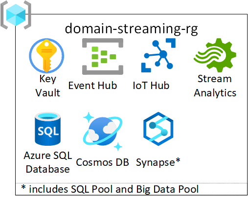

# Enterprise Scale Analytics and AI - Data Integration: Stream Processing

> **General disclaimer** Please be aware that this template is in private preview. Therefore, expect smaller bugs and issues when working with the solution. Please submit an Issue in GitHub if you come across any issues that you would like us to fix.

## Description

[**Enterprise Scale Analytics and AI**](https://github.com/Azure/Enterprise-Scale-Analytics) solution pattern emphasizes self-service and follows the concept of creating landing zones for cross-functional teams. Operation and responsibility of these landing zones is handed over to the responsible teams inside the data node. The teams are free to deploy their own services within the guardrails set by Azure Policy. To scale across the landing zones more quickly and allow a shorter time to market, we use the concept of `Data Integration` and `Data Product` templates. Data Integration and Data Product templates are blueprints, which can be used to quickly spin up environments for these cross-functional teams. The teams can fork these repositories to quickly spin up environments based on their requirements. This Data Integration template deploys a set of services, which can be used for data stream processing. The template includes a set of different services for processing data streams, which allows the teams to choose their tools based on their requirements and preferences.

## What will be deployed?

By default, all the services which come under Data Integration Streaming are enabled, and you must explicitly disable services that you don't want to be deployed.

> **Note:** Before deploying the resources, we recommend to check registration status of the required resource providers in your subscription. For more information, see [Resource providers for Azure services](https://docs.microsoft.com/azure/azure-resource-manager/management/resource-providers-and-types).

For each Data Integration Streaming template, the following services are created:

- [Key Vault](https://docs.microsoft.com/azure/key-vault/general)
- [Event Hub](https://docs.microsoft.com/azure/event-hubs/)
- [IoT Hub](https://docs.microsoft.com/azure/iot-hub/about-iot-hub)
- [Stream Analytics](https://docs.microsoft.com/azure/stream-analytics/stream-analytics-introduction)
- [Cosmos DB](https://docs.microsoft.com/azure/cosmos-db/introduction)
- [Synapse Workspace](https://docs.microsoft.com/azure/synapse-analytics/)
- [Azure SQL Database](https://docs.microsoft.com/azure/azure-sql/database/)
- [SQL Pool](https://docs.microsoft.com/azure/synapse-analytics/sql-data-warehouse/sql-data-warehouse-overview-what-is)
- [SQL Server](https://docs.microsoft.com/sql/sql-server/?view=sql-server-ver15)
- [SQL Elastic Pool](https://docs.microsoft.com/azure/azure-sql/database/elastic-pool-overview)
- [BigData Pool](https://docs.microsoft.com/sql/big-data-cluster/concept-data-pool?view=sql-server-ver15)

You have two options for deploying this reference architecture:

1. Use the `Deploy to Azure` button for an immediate deployment
2. Use GitHub Actions or Azure DevOps Pipelines for an automated, repeatable deployment

## Navigation Menu

* [Prerequisites](./docs/ESA-IntegrationStreaming-Prerequisites.md)
* Option 1: Deploy to Azure - Quickstart

|Data Integration Streaming |
|:---------------------|
<!--  -->

* Option 2: Deploy reference implementation :
  * [Prepare the deployment](./docs/ESA-IntegrationStreaming-PrepareDeployment.md)
  * [Using Azure DevOps](./docs/ESA-IntegrationStreaming-DeployUsingAzureDevops.md)
  * [Using GitHub Actions](./docs/ESA-IntegrationStreaming-DeployUsingGithubActions.md)
* [Code Structure](./docs/ESA-IntegrationStreaming-CodeStructure.md)
* [Known issues](./docs/ESA-IntegrationStreaming-KnownIssues.md)

## Enterprise Scale Analytics and AI - Documentation and Implementation

- [Documentation](https://github.com/Azure/Enterprise-Scale-Analytics)
- [Implementation - Data Management](https://github.com/Azure/data-management-zone)
- [Implementation - Data Landing Zone](https://github.com/Azure/data-landing-zone)
- [Implementation - Data Integration - Batch](https://github.com/Azure/data-integration-batch)
- [Implementation - Data Integration - Streaming](https://github.com/Azure/data-integration-streaming)
- [Implementation - Data Product - Reporting](https://github.com/Azure/data-product-reporting)
- [Implementation - Data Product - Analytics & Data Science](https://github.com/Azure/data-product-analytics)

## Contributing

This project welcomes contributions and suggestions. Most contributions require you to agree to a Contributor License Agreement (CLA) declaring that you have the right to, and actually do, grant us the rights to use your contribution. For details, visit <https://cla.opensource.microsoft.com>.

When you submit a pull request, a CLA bot will automatically determine whether you need to provide a CLA and decorate the PR appropriately (e.g., status check, comment). Simply follow the instructions provided by the bot. You will only need to do this once across all repositories using our CLA.

This project has adopted the [Microsoft Open Source Code of Conduct](https://opensource.microsoft.com/codeofconduct/). For more information see the [Code of Conduct FAQ](https://opensource.microsoft.com/codeofconduct/faq/) or contact [opencode@microsoft.com](mailto:opencode@microsoft.com) with any additional questions or comments.
